# Sav3ana
 
Sav3ana: Batch transactions, smart savings, easy card payments and On/Off Ramp.

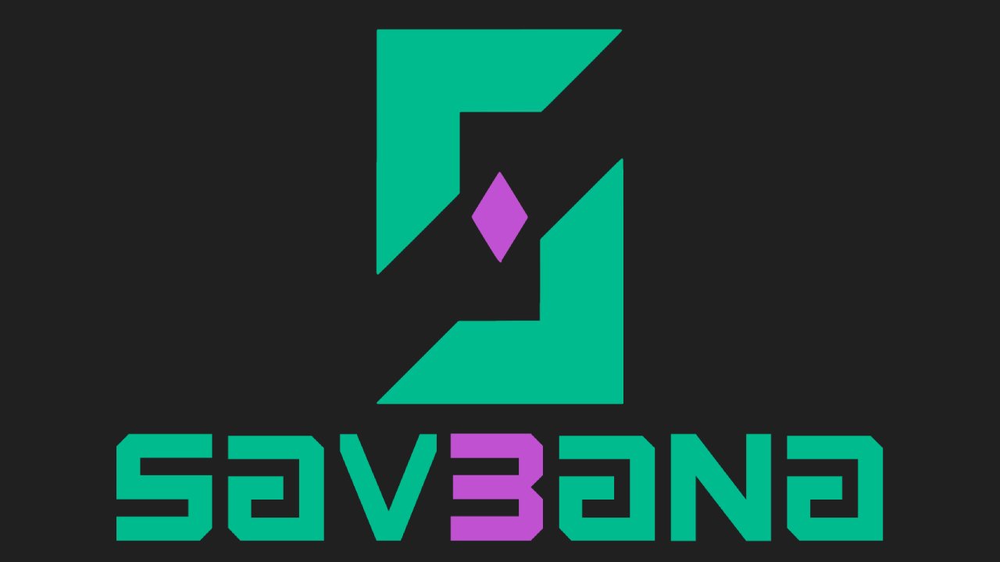

## Fast Links:

WALLET CODE: [CODE](./Sav3ana/)

PLAYSTORE LINK: [LINK](https://play.google.com/store/apps/details?id=com.altaga.sav3ana.soon)

VIDEODEMO: [VIDEO](pending...)

# System Diagram:

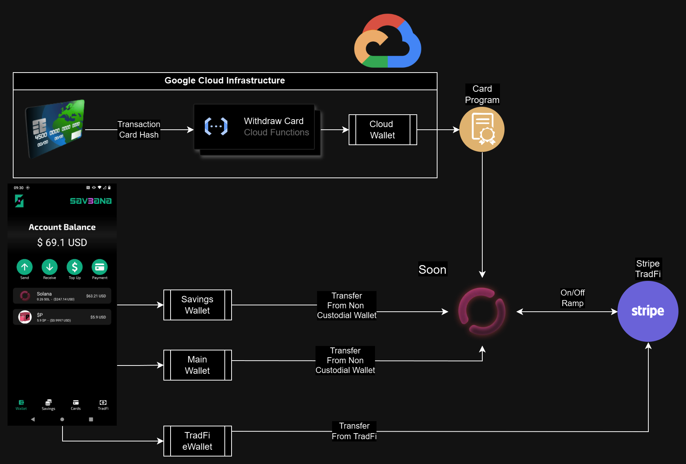

- Main Account: Within the schematics you can see that we have our main wallet, which is a Non Custodial Wallet, to which you will have to save its mnemonic at the time of its creation.

- Savings Account: This wallet, like the previous one, is a Non Custodial Wallet, which will save the savings on each transaction according to the chosen savings protocol.

- Card Account: This wallet is based on a PDA Account controlled by a Program, in order to be used as a "Smart Contract Wallet". More details in the section [Card Payments](#card-payments)

- Batch Transactions: Through Soon network, it is possible to carry out several batch transactions using a single signature, this allows us all the incredible functionalities of our wallet.

- Stripe: Using Stripe financial services we can perform On/Off ramp directly from our wallet with a simple click. More details at [On/Off Ramp](#onoff-ramp)

- Google Cloud: All services like Stripe are configured on the Google Cloud due to the private credentials these services use.
  
# Features:

Our app, as we mentioned before, aims to increase crypto adoption, improve the financial health of users, and give them more access to services without all the hassles of traditional banks.[1](#references)

## Batch Transactions:

Soon has always had the ability to perform multiple transactions with a single signature, however we decided to implement a way to perform these types of transactions directly from our UI, in order to be able to do all types of multiple transfers through a single transaction. [2](#references)

### Screen:

To use this feature you must enter the Send button, this will show a form that we must fill out with all the transactions you want.

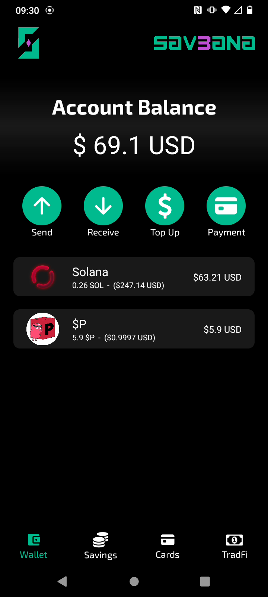 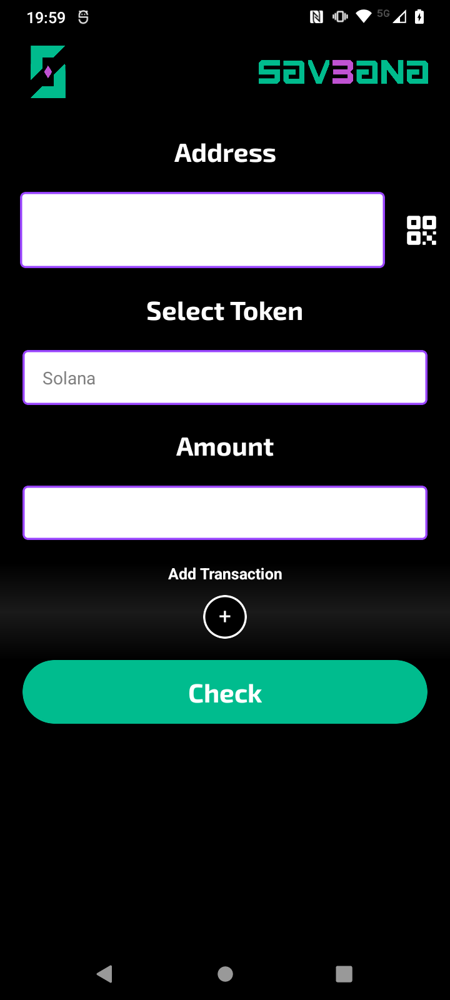 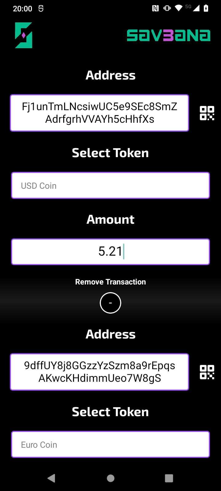

Once all the transactions are ready, we will press the Check button. This will run a simulation of the transaction and show the details of the transaction. If everything is correct, we can execute it with the Execute button. A few milliseconds later, we will see the confirmation and a link to the explorer.

The entire process of making a single transaction is done using the following code.

- [SEND CODE](./Sav3ana/src/screens/sendWallet/sendWallet.js)
- [MODAL CODE](./Sav3ana/src/utils/transactionsModal.js)

## Smart Savings:

One of the missions of our application is to encourage constant savings, this is normally done through financial education and good consumption habits. However, we go one step further, we make small savings in each purchase and transaction that the user makes.

The savings account has a couple of customizable functions.

- Activate Savings: This switch allows you to turn the savings account on and off, so that the user can stop attaching savings transactions to each purchase.

- Savings Period: This drop-down menu allows the user to set a savings goal, whether daily, weekly, monthly or yearly. NOTE: For now it is possible to change it without limitations, but we do not want the user to be able to remove the fixed date of their savings until the deadline is met.

- Savings Protocol: This drop-down menu gives us two options, percentage savings, which will take the percentage that we configure in each purchase or smart savings, this protocol will be explained later. [HERE](#savings-protocols)

### Screen:

The savings wallet currently makes savings based on SOL, but in the future we will include stablecoins such as USDC.

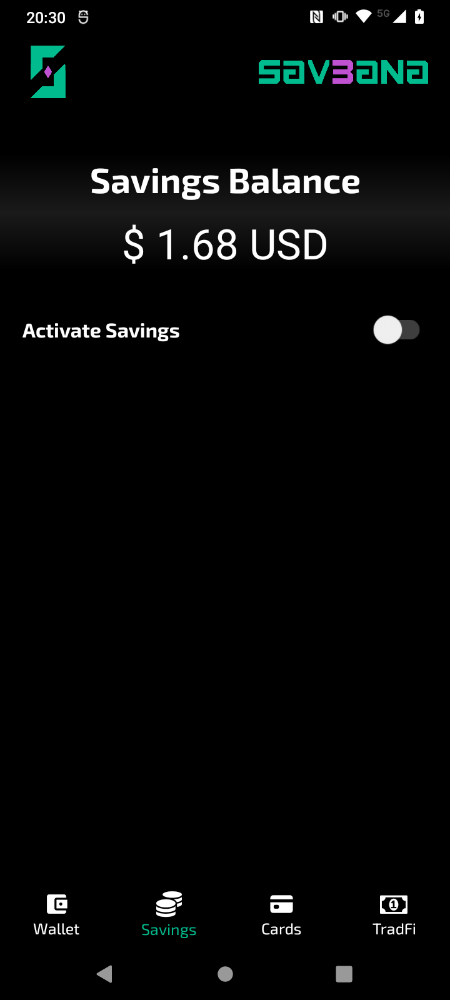 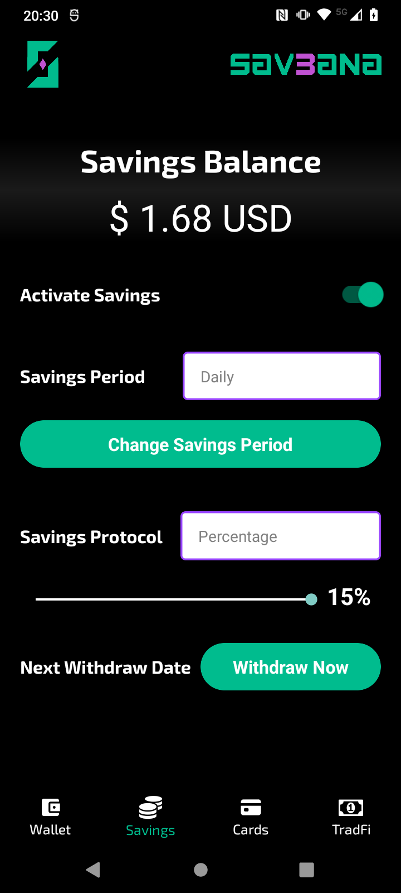 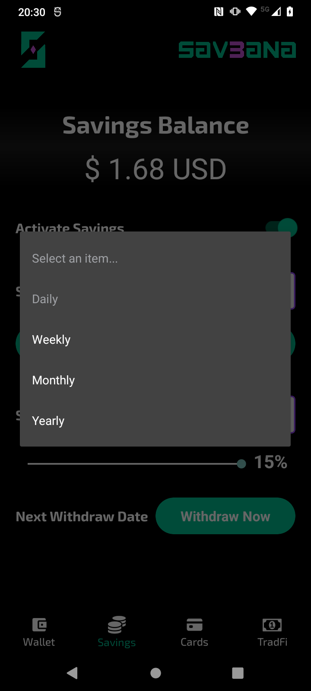

All technical implementations for this tab are included here.
- [TAB CODE](./Sav3ana/src/screens/main/tabs/tab2.js)

### Savings Protocol:

- Balanced Protocol, this protocol performs a weighted rounding according to the amount to be paid in the transaction, so that the larger the transaction, the greater the savings, in order not to affect the user. And this is the function code:

        export function balancedSavingToken(number, usd1, usd2) {
            const balance = number * usd1;
            let amount = 0;
            if (balance <= 1) {
                amount = 1;
            } else if (balance > 1 && balance <= 10) {
                amount = Math.ceil(balance);
            } else if (balance > 10 && balance <= 100) {
                const intBalance = parseInt(balance, 10);
                const value = parseInt(Math.round(intBalance).toString().slice(-2), 10);
                let unit = parseInt(Math.round(intBalance).toString().slice(-1), 10);
                let decimal = parseInt(Math.round(intBalance).toString().slice(-2, -1), 10);
                if (unit < 5) {
                unit = '5';
                decimal = decimal.toString();
                } else {
                unit = '0';
                decimal = (decimal + 1).toString();
                }
                amount = intBalance - value + parseInt(decimal + unit, 10);
            } else if (balance > 100) {
                const intBalance = parseInt(Math.floor(balance / 10), 10);
                amount = (intBalance + 1) * 10;
            }
            return new Decimal(amount).sub(new Decimal(balance)).div(usd2).toNumber();
        }

- Percentage protocol, unlike the previous protocol, this one aims to always save a percentage selected in the UI.

        export function percentageSaving(number, percentage) {
            return number * (percentage / 100);
        }

All technical implementations for this protocols are included here.
- [PROTOCOLS CODE](./Sav3ana/src/utils/utils.js)

## Card Payments:

Part of people's daily adoption of crypto is being able to use it in the same way they use their cell phone or card to make payments, but without neglecting the security and decentralization of crypto. [3](#references)

### Contactless Payment:

Payment cards are not just a traditional NFC chip, in fact they are more like small computers with installed programs, which run in milliseconds at the time the chip is being scanned.[4](#references).

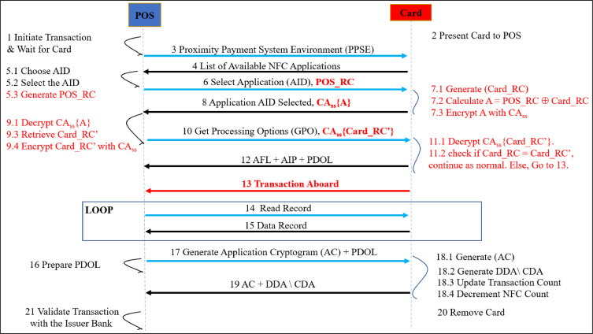

So we implemented this card reading to be able to read the sensitive data of the payment cards and with this be able to generate a virtual card that could be used for crypto payments.

All technical implementations for this feature are included here.
- [READ CARD CODE](./Sav3ana/src/screens/main/components/readCard.js)

### Virtual Card:

However, an additional challenge arises: how do we ensure that virtual cards and the funds they contain maintain decentralization, ensuring that the assets remain the property of the user? It is important to remember that card payments will not involve direct intervention by the wallet.

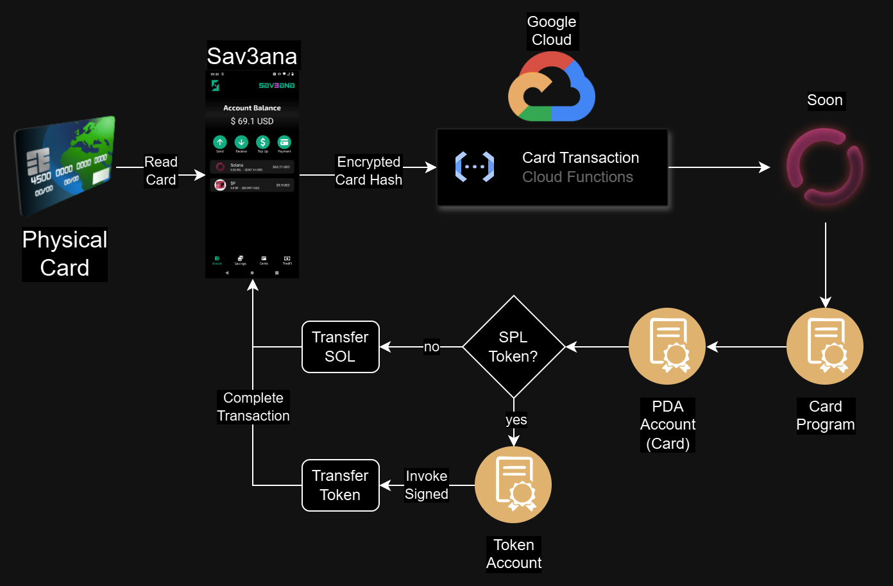

This problem cannot be solved with an EOA Wallet in Custodial Wallet mode, since the private keys would not be under the user's control. The solution consists of developing a program that generates "Virtual Cards" using PDA's (Program Derived Addresses), which allows maintaining decentralization and user control over their assets.

All technical implementations for this program are included here.
- [PROGRAM CODE](./Programs/src/lib.rs)
- [TAB CODE](./Sav3ana/src/screens/main/tabs/tab3.js)

### Program:

The program has 4 fundamental functions, the code is perfectly commented, if you want to delve deeper into its operation please look at the code we have shared in the repository.

- Create Card: This function generates a PDA with the data we provide, the PDA to be able to store information, we add public information that allows us to improve functionality.
  -   owner: [u8; 32], // Card Owner
  -   nfc: bool,   // Activate or Deactivate
  -   types: bool, // Physical or Virtual
  -   kind: u8,    // 0 = Debit, 1= Credit, 2=Prepaid, etc
  -   brand: u8,   // 0 = VISA, 1 = MASTERCARD, 2 = AMEX, etc

- ChangeInfo: If necessary, it is possible to make changes to the card's metadata, for example to activate or deactivate contactless payments.

- Purchase: Through this function, payments are made with SOL, this is done with a simple transfer.
  
- PurchaseToken: Finally, this function allows us to make payments with SPL tokens. This is done through CPI (cross program invocation), since we need the PDA to sign the transfer of tokens that it owns.

All technical implementations for this program are included here.

- [PROGRAM CODE](./Programs/src/lib.rs)
- [CLIENT TEST CODE](./Programs/client/)

### Screen:

We deploy all of this together in a simple UI where the user can recharge their virtual card like a prepaid card, which is linked, as we said, to their physical card.

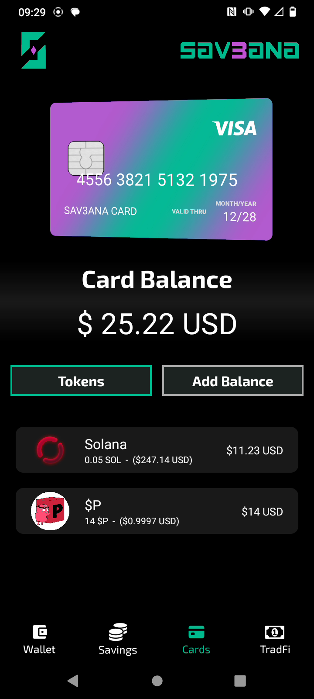 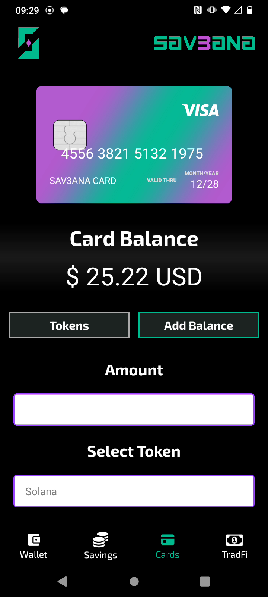

All technical implementations for this tab are included here.

- [TAB CODE](./Sav3ana/src/screens/main/tabs/tab3.js)

## On/Off Ramp:

We provide TradFi services through Stripe APIs, which allow us to have the following features in the app.

- eWallet: When Stripe services are active, we can create eWallets where users can have their TradFi money.
- Currencies: Depending on the user's jurisdiction, they may have their own currency in the app. At the moment, we only support USD (US Dollar), EUR (Euro), and MXN (Mexican Peso).

### On Ramp:

The On Ramp service is completely controlled from Google Cloud, since no user signature is required to make a transfer from Stripe to the company account, and in the same cloud we carry out the transaction in the Soon network to transfer the desired token to the user.

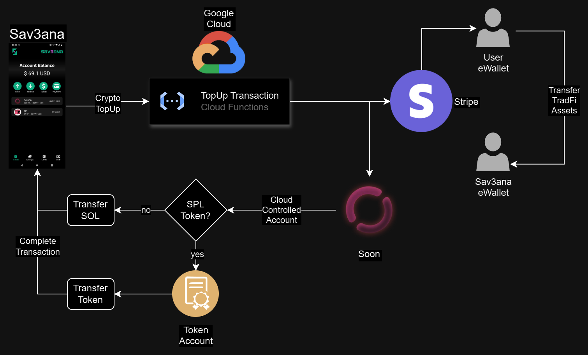

### Off Ramp:

The Off Ramp service is a little different, as it requires first making the cryptocurrency transfer from the user's account, so the transfer diagram is as follows, although it shares a lot of similarity with the previous one.

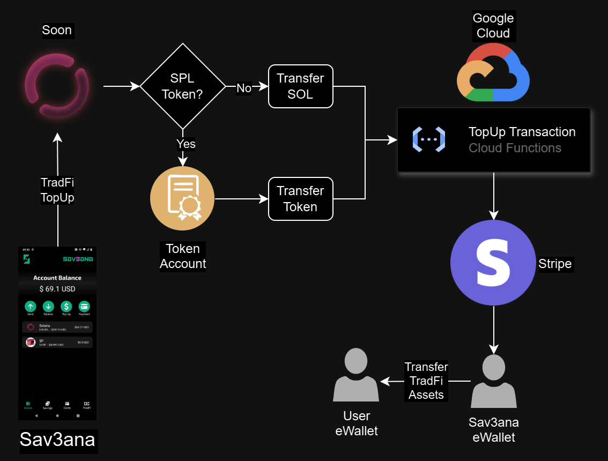
 
### Screen:

This interface allows us to manage our TradFi money and at the same time be able to On/Off ramp our assets between each other with a single click.

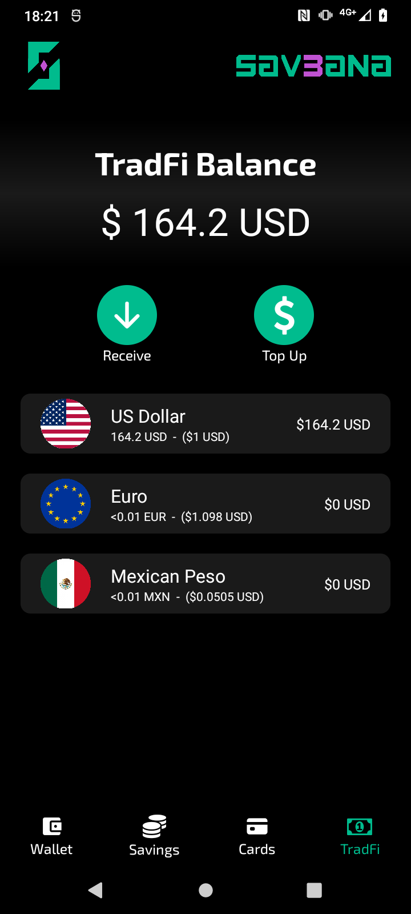 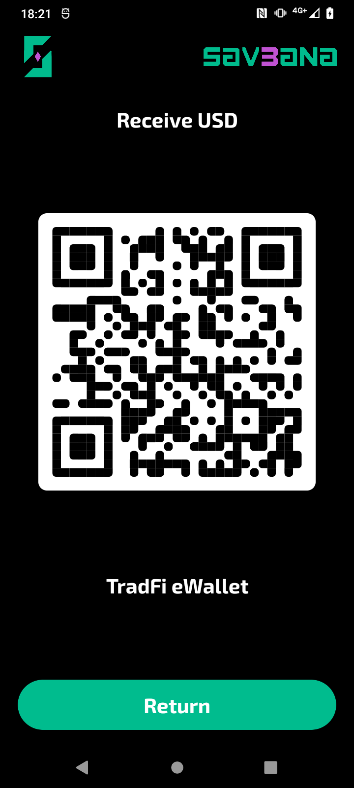 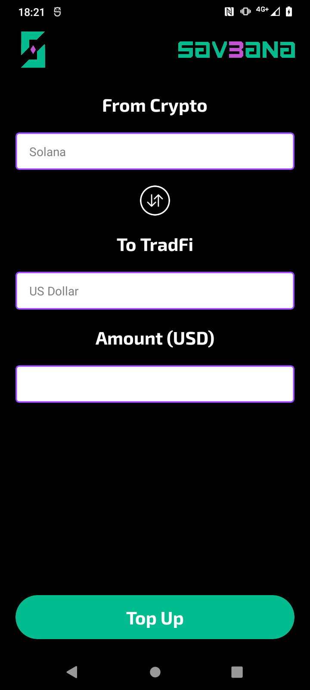

All technical implementations for this tab are included here.

- [TAB CODE](./Sav3ana/src/screens/main/tabs/tab4.js)
- [CLOUD TOPUP](./Cloud/TopUp/index.js)

# References:

1. https://www.21shares.com/en-eu/research/monthly-review-jan-24
2. https://solana.com/docs/core/transactions
3. https://solana.com/developers/defi
4. https://medium.com/@androidcrypto/talk-to-your-credit-card-android-nfc-java-d782ff19fc4a
5. https://www.nerdwallet.com/article/small-business/what-is-stripe